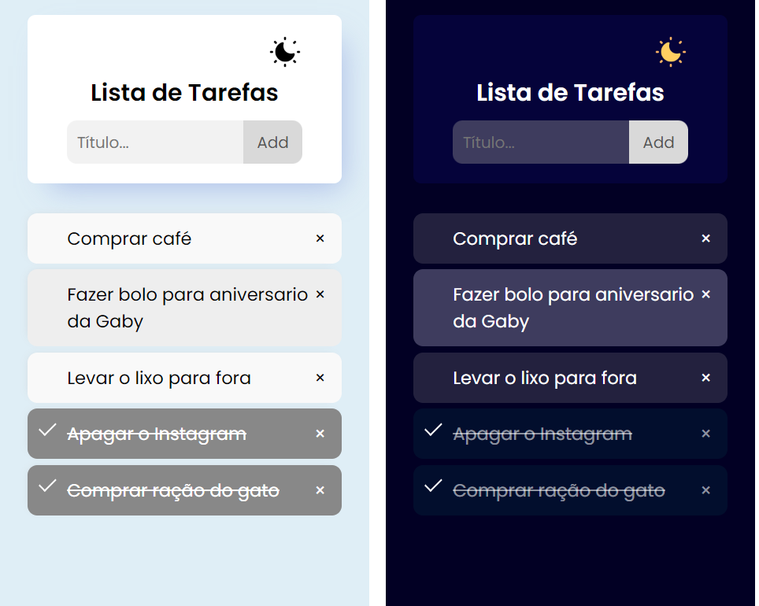

## 🏋️‍♂️ Projeto HTML + CSS + Javascript.

Criação de uma lista de tarefas / TO DO LIST.   
Os temas abordados são: 
- Responsividade.
- Dark mode.
- Criação de elementos dinamicamente. 
- Manipulação de elementos por meio de eventos.
- Alerta de tela com Toastify.
- Funções reutilizáveis. 

## Estrutura do Projeto:

- index.html: Arquivo HTML principal.
- assets/css/styles.css: Arquivo CSS para estilização.
- assets/js/main.js: Arquivo JavaScript contendo as funcionalidades descritas acima.

## 💻 Tecnologias utilizadas nesse projeto:

  
  
  

## Funcionalidades:

- Adição de tarefa.
- Marcação de tarefa quando concluída.
- Exclusão de tarefas.
- Alteração entre os modos light e dark.

## Resumo - Método `toggle()`:

O método toggle() é uma função do JavaScript usada para adicionar ou remover classes de um elemento HTML de forma condicional. Ele faz parte da API de manipulação de classes do DOM e é bastante útil para alternar entre estados, como em temas de modo claro e escuro.

- Esse trecho de código permite que, ao clicar em qualquer item de uma lista não ordenada (<ul>), a classe 'checked' seja alternada no item clicado (<li>), adicionando a estilização de marcação.

[code](assets/img/code.png)

- Esse trecho de código JavaScript é responsável por alternar a classe dark-mode no body e em elementos filhos. Alterando o tema da página. 

[code](assets/img/code2.png)

## 💻 Preview:
- Veja como ficou o projeto acessando: [Link]()
  

## Autor
- Ernandes Neponuceno - [Linkedin]()
